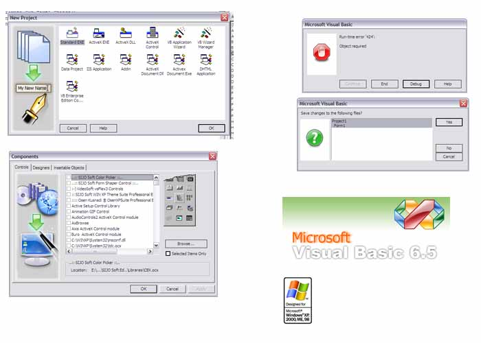

<div align="center">

## \_\_\_\_\_\_\_\_\_\_\_\_\_\_\_\_\_\_\_\_\_\_\_\_\_\_\_\_\_\_\_\_\<\_\.\.::VB 6\.5 \(The User Friendly Version Not Released\)


</div>

### Description

VB 6.5 (The User Friendly Version Not Released)

See Screenshot

Download the vb6ide.zip from www.sijo.8k.com

copy and paste it into your VB Path (with vb6.exe)

Keep a back up of your existing VB6IDE.dll file

Download VB6.exe also,

It gives and amazing look to vbp, cls,frm,bas files

by changing the icon

Developed by SIJo Soft Developing team

if you are from Kerala, SIJO Soft Malayalam Notepad is my another submission. see this also

The best Malayalam Writer, Malayalam Notepad and Best Malayalam Editer
 
### More Info
 


<span>             |<span>
---                |---
**Submitted On**   |
**By**             |[SIJO](https://github.com/Planet-Source-Code/PSCIndex/blob/master/ByAuthor/sijo.md)
**Level**          |Advanced
**User Rating**    |4.1 (37 globes from 9 users)
**Compatibility**  |VB 5\.0, VB 6\.0
**Category**       |[Windows System Services](https://github.com/Planet-Source-Code/PSCIndex/blob/master/ByCategory/windows-system-services__1-35.md)
**World**          |[Visual Basic](https://github.com/Planet-Source-Code/PSCIndex/blob/master/ByWorld/visual-basic.md)
**Archive File**   |[](https://github.com/Planet-Source-Code/sijo-vb-6-5-the-user-friendly-version-not-released__1-59965/archive/master.zip)


### Source Code

```
Download VB6IDE.dll from
http://www.parakulamjewels.com/soft/vb6ide.dll
http://www.parakulamjewels.com/soft/vb6.zip
Developed by SIJO Soft Developing Team
if you are from Kerala, SIJO Soft Malayalam Notepad is my another submission. see this also
Do u know about Malayalam Notepad?
Malayalam Writer, Best Malayalam Reader?
Malayalam Editor, Malayalam Wordpad?
look at my other code also
```

